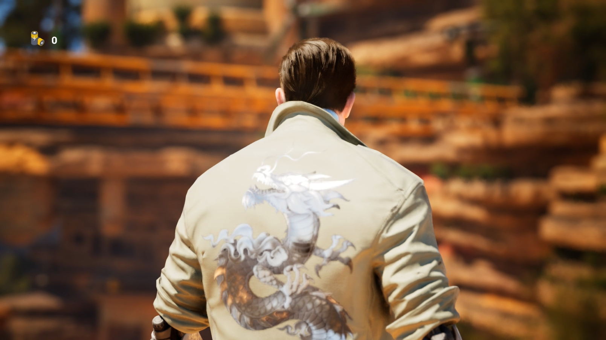
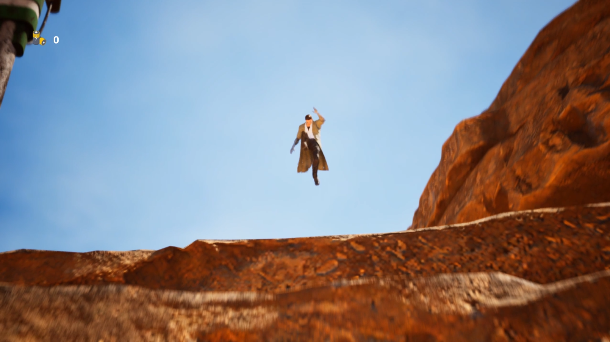
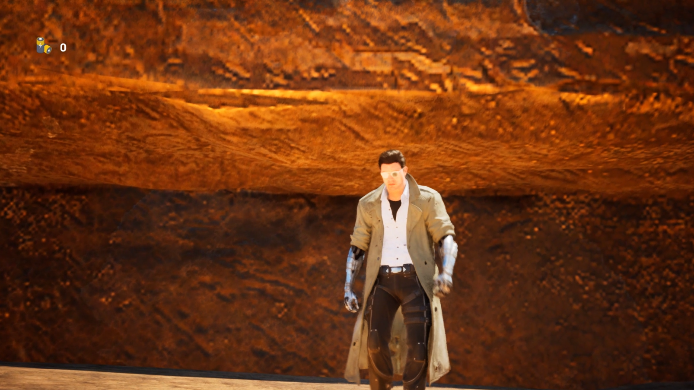
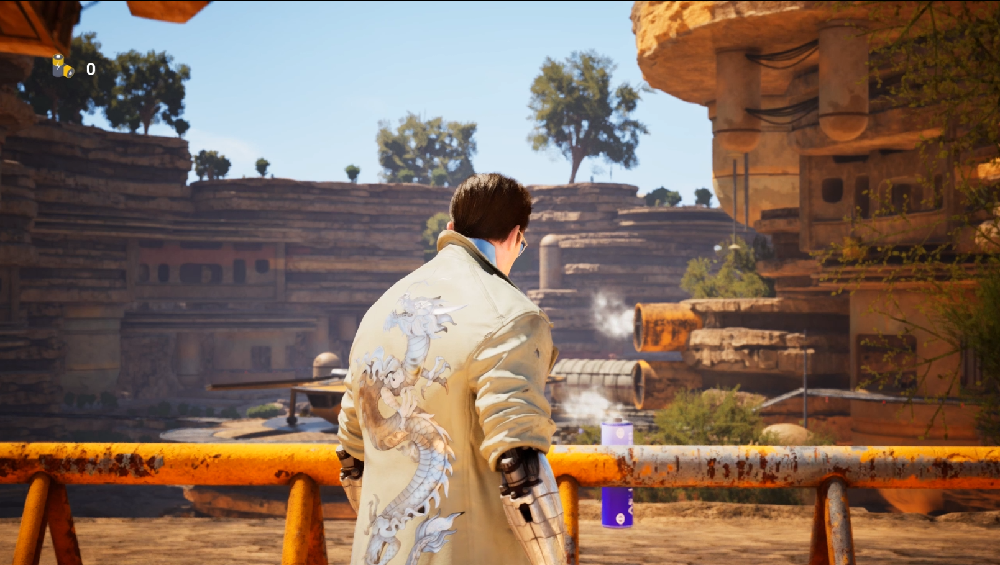
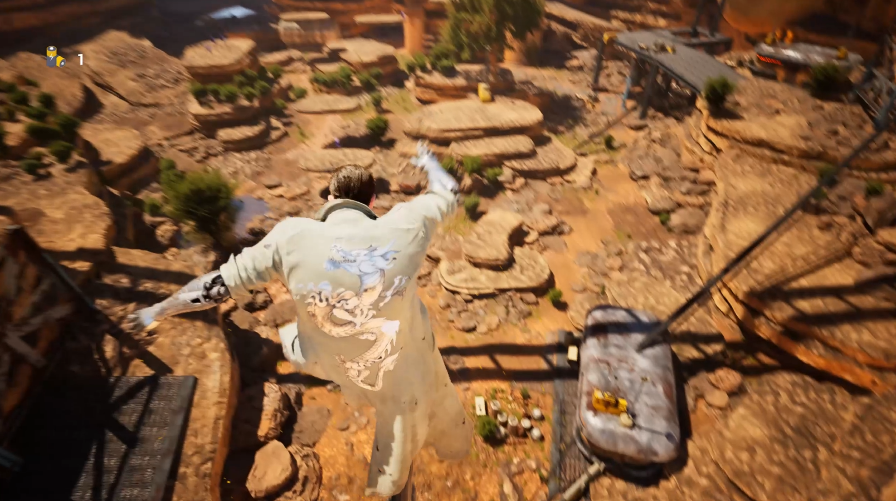
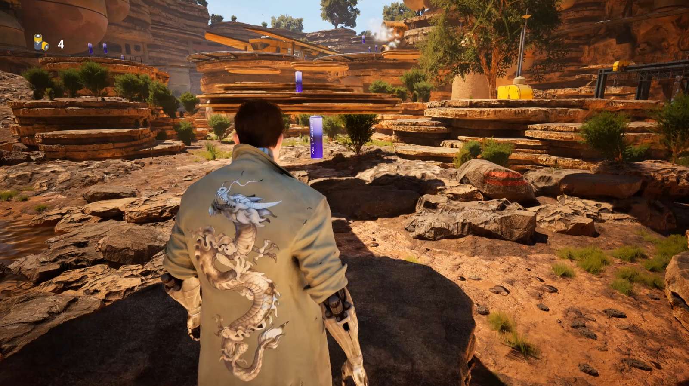

# Unreal Engine Workshop - 3D Platformer

  

  
  
  

## About

This is a 3D platformer game developed in Unreal Engine during a one-week Unreal Workshop, completed in just 2 days. The project showcases the capabilities of Unreal Engine 5 for rapid game development and prototyping.

## Features

- Fluid character movement and platforming mechanics
- Level design with various obstacles and challenges
- Responsive controls optimized for gameplay
- High-quality visual assets from Quixel Bridge & Unreal Asset Store
- Smooth character animations
- Interactive game elements and collectibles

## Technologies

- **Unreal Engine 5**: Next-generation game engine with advanced rendering capabilities
- **Blueprints**: Visual scripting system for gameplay mechanics and logic
- **Game Animation Sample**: Pre-built animation assets for character movement (Motion Matching)
- **Quixel Bridge**: Integration for high-quality environmental assets and textures

## Getting Started

### Installation

1. Download the latest release from the Releases page
2. Extract the downloaded archive
3. Launch the game executable (.exe) from the extracted folder
4. Wait for the initial loading screen to complete
5. Enjoy playing the game!

## See It In Action

https://github.com/user-attachments/assets/9e07beba-594d-4045-bde7-79c53531c617

  
   
  <em>Cinematic view of the character traversing the dynamic environment</em>

  
   
  <em>Environmental design with Quixel assets and UE Asset Store</em>

  
   
  <em>Cinematic view showcasing character movements</em>

  
   
  <em>Level design showcasing various obstacles and collectible batteries</em>

  
   
  <em>Jump mechanic</em>

  
   
  <em>Overview of the game world</em>

## Development Process

This project was developed as part of an Unreal Engine Workshop with a focus on rapid prototyping and implementation. The entire development cycle was compressed into just 2 days, demonstrating the efficiency of Unreal Engine 5 for game creation.

## Controls

- **WASD**: Character movement
- **Space**: Jump
- **Shift**: Sprint
- **Mouse**: Camera control
